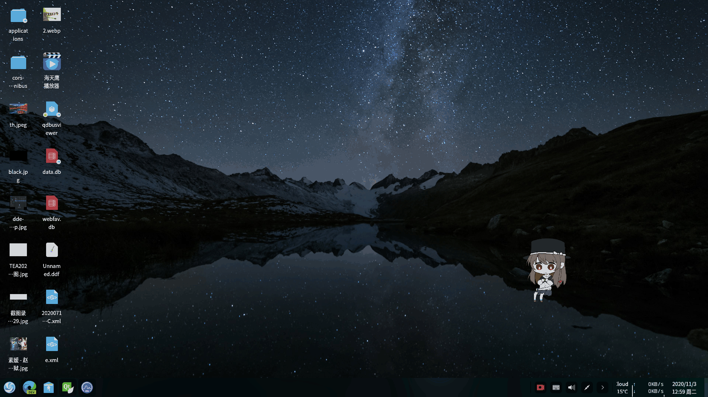

# Qt 海天鹰桌宠
基于 Qt 的 桌面宠物动画，左击吃一次，1分钟吃一次。  
已编译好的 HTYDeskPet 程序适用 64 位 Linux 系统 Qt5 环境，双击运行，终端运行 ./install.sh 生成 desktop。  
  
## 参考
https://mp.weixin.qq.com/s/QiunWyDEHI1Hqy3EcBGntA  
https://github.com/CryFeiFei/Qt_Teach/tree/master/Animation（增加拖动、保存位置、右键退出，不停吃改为定时吃）